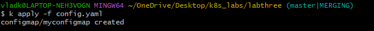
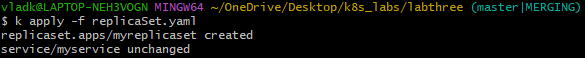
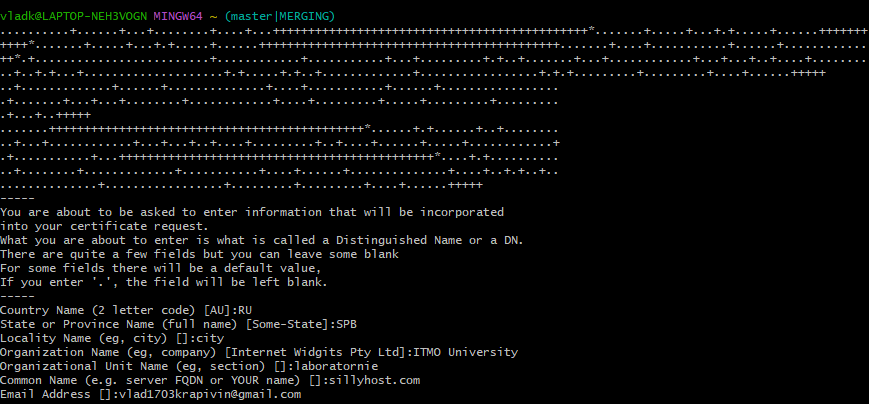
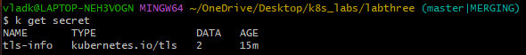
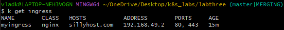
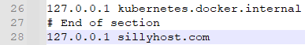
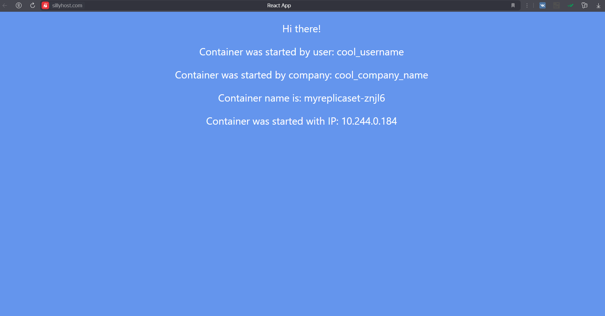
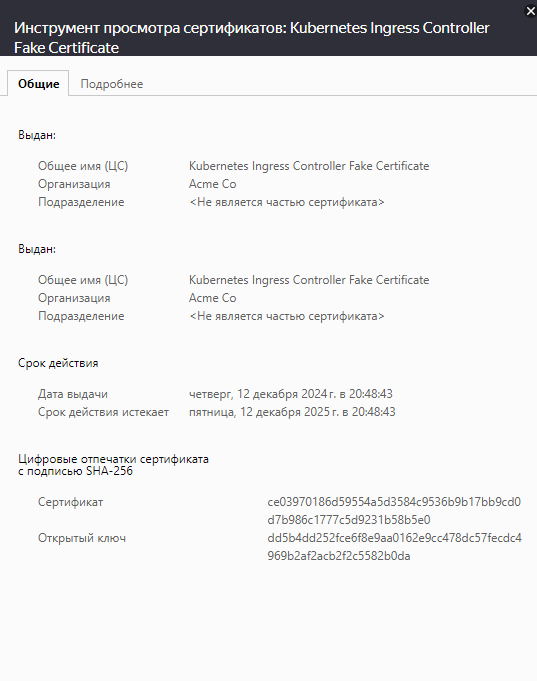

University: [ITMO University](https://itmo.ru/ru/)\
Faculty: [FICT](https://fict.itmo.ru)\
Course: [Introduction to distributed technologies](https://github.com/itmo-ict-faculty/introduction-to-distributed-technologies)\
Year: 2024/2025\
Group: K4110c\
Author: Krapivin Vladislav Valerievich\
Lab: Lab3\
Date of create: 03.12.2024\
Date of finished:

# Лабораторная работа №3 "Сертификаты и "секреты" в Minikube, безопасное хранение данных."
## Цель работы
Познакомиться с сертификатами и "секретами" в Minikube, правилами безопасного хранения данных в Minikube.
## Ход работы
### 1.Запуск Minikube
`minikube start`
### 2.Создание манифеста [config.yaml](https://github.com/VladKrapivin/2024_2025-introduction_to_distributed_technologies-k4110c-krapivin_v_v/blob/main/lab_3/source/config.yaml) в котором описывается ConfigMap

> Configmap — это объект Kubernetes, который используется для хранения неконфиденциальных данных конфигурации в виде пар «ключ — значение».
### 3.Создание манифеста [replicaSet.yaml](https://github.com/VladKrapivin/2024_2025-introduction_to_distributed_technologies-k4110c-krapivin_v_v/blob/main/lab_3/source/replicaSet.yaml) в котором описываются ReplicaSet и Service

### 4.Выпуск сертификата при помощи утилиты [OpenSSL](https://github.com/openssl/openssl?tab=readme-ov-file#overview) на полное доменное имя (FQDN) необходимого интернет-хостинга.

### 5.Создание конфигурационного файла Secret.

> Secret — это объект Kubernetes, предназначенный для хранения чувствительных данных, таких как пароли, ключи шифрования и API-токены.
### 6.Создание манифеста [ingress.yaml](https://github.com/VladKrapivin/2024_2025-introduction_to_distributed_technologies-k4110c-krapivin_v_v/blob/main/lab_3/source/ingress.yaml) в котором описывается Ingress

> Ingress — это объект API Kubernetes, который используется для предоставления доступа к маршрутам HTTP и HTTPS извне кластера сервисам внутри кластера.
### 7.Изменение файла host - ввод FQDN и IP адреса ingress.

### 8.Вход в веб-приложение 

### 9.Просмотр сертификата

### 10.Схема организации контейеров и сервисов
