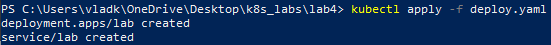

University: [ITMO University](https://itmo.ru/ru/)\
Faculty: [FICT](https://fict.itmo.ru)\
Course: [Introduction to distributed technologies](https://github.com/itmo-ict-faculty/introduction-to-distributed-technologies)\
Year: 2024/2025\
Group: K4110c\
Author: Krapivin Vladislav Valerievich\
Lab: Lab4\
Date of create: 13.12.2024\
Date of finished:

# Лабораторная работа №4 "Сети связи в Minikube, CNI и CoreDNS"
## Цель работы
Ознакомиться с CNI Calico и функцией IPAM Plugin, изучить особенности работы CNI и CoreDNS.
## Ход работы
### 1. Запуск нового `multi-node` кластера с 2 нодами

### 2. Проверка подов и нод

### 3. Присвоение `label` для ранее запущенных нод по признаку географического местоположения

### 4. Просмотр и удаление пула адресов по умолчанию

### 5. Создание новых пулов адресов путем применения манифеста [ippool.yaml](source/ippool.yaml)

### 6. Создание манифеста [deploy.yaml](source/deploy.yaml) описывающего `deployment` с двумя репликами контейнера и `service` для доступа к нему

### 7. Просмотр подов и деплоймента

### 8. Проброс портов

### 9. Вход в веб-приложение

### 10. Просмотр IP подов

### 11. Проверка доступности подов командой `ping`

### 12. Схема организации контейеров и сервисов
